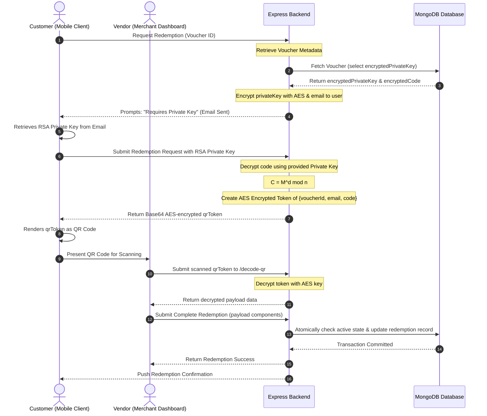

# GiftVault: Core Cryptographic & Personalization System Specification
This document outlines the core cryptographic protocols (RSA and AES), the dynamic QR code generation/verification flow, and the personalized voucher recommendation engine implemented in the **GiftVault** digital loyalty and voucher management platform. 

This specification is prepared as technical source material for the final year project report.

---

## 0. Project Architecture & Directory Layout

The **GiftVault** application follows a modern decoupled architecture consisting of a Node.js/Express REST API backend and a Vite-powered React single-page application (SPA) frontend. 

The complete codebase file structure and functional descriptions of key directories/files are detailed below:

```
GiftVault/
├── backend/                         # Express/NodeJS Backend REST API Server
│   ├── config/                      # System Configurations
│   │   └── db.js                    # Database connection handler (MongoDB connection using Mongoose)
│   ├── config.js                    # Environment Variable configurations mapping
│   ├── app.js                       # Express application initializations and middleware setup
│   ├── index.js                     # Root entry point of the server
│   ├── controllers/                 # Request Handlers & Business Logic Layer
│   │   ├── authController.js        # User/Vendor/Admin authentication & registration logic
│   │   ├── dashboardController.js   # Analytics queries and dashboard aggregation metrics
│   │   ├── loyaltyController.js     # Loyalty stamp logic, stamp collection, and dynamic QR verification
│   │   ├── otpController.js         # Multi-factor authentication, phone verification, and SMS OTP
│   │   ├── userController.js        # User progress, user profile management and data queries
│   │   └── voucherController.js     # Voucher creation, RSA/AES hybrid verification, and category affinity recommendations
│   ├── middleware/                  # Request Interceptors
│   │   └── authMiddleware.js        # JWT validation and role-based access control (protect, isVendor, isAdmin)
│   ├── models/                      # MongoDB Database Schemas (Mongoose Models)
│   │   ├── AnalyticsModel.js        # Platform-wide metrics and vendor insights tracking
│   │   ├── BulkVoucherModel.js      # Model to track batch generation of vouchers
│   │   ├── DynamicQRModel.js        # One-time expiring stamp tokens schema (has automatic 24h TTL)
│   │   ├── LoyaltyRuleModel.js      # Vendor rules for stamp cards (stamps per scan, point threshold)
│   │   ├── OtpModel.js              # One-Time Password schema (stores verification codes & expirations)
│   │   ├── UserModel.js             # User Accounts (roles, email, password hashes, global points)
│   │   ├── UserProgressModel.js     # Tracks customer progress (current stamps, pending rewards) per vendor
│   │   └── VoucherModel.js          # Voucher rules (encrypted code, public key, encrypted private key)
│   ├── routes/                      # Route Definitions (mapping URL endpoints to Controllers)
│   │   ├── authRoute.js             # /api/auth endpoints
│   │   ├── booksRoute.js            # /api/books CRUD routes
│   │   ├── dashboard.js             # /api/dashboard metrics
│   │   ├── loyaltyRoute.js          # /api/loyalty stamp collection & verification
│   │   ├── otpRoutes.js             # /api/otp sms and verification routes
│   │   ├── userRoute.js             # /api/users profile endpoints
│   │   └── voucherRoute.js          # /api/vouchers claim, redeem, recommend, and decode endpoints
│   └── utils/                       # Cryptographic & Helper Utilities
│       ├── emailService.js          # Transactional email service (transmits private keys via Nodemailer)
│       ├── encryption.js            # Symmetric cryptography wrappers (AES-256-CBC, Base64 QR tokens)
│       └── rsa.js                   # Custom RSA cryptography library built from first principles
│
└── frontend/                        # React Client Application (Vite Build System)
    ├── package.json                 # Dependency list (lucide-react, qrcode.react, react-qr-reader)
    ├── vite.config.js               # Bundler settings
    ├── index.html                   # HTML Entry Point
    ├── src/                         # React Application Source Directory
    │   ├── main.jsx                 # Initial mounting entry point
    │   ├── App.jsx                  # Root Component (defines React Router endpoints, auth wrappers)
    │   ├── index.css                # Global CSS stylesheet & Tailwind setup
    │   ├── api/                     # Server Integration layer using Axios
    │   │   ├── axios.js             # Global instance with interceptors for authorization headers
    │   │   ├── loyalty.js           # API calls for stamp rules, scans, and rewards
    │   │   └── vouchers.js          # API calls for recommendations, decodes, and redemptions
    │   ├── components/              # Modular UI Components
    │   │   ├── Sidebar.jsx          # Collapsible navigation drawer
    │   │   ├── ProtectedRoute.jsx   # Client-side router protection (blocks unauthenticated visits)
    │   │   ├── AuthRedirect.jsx     # Redirects authenticated users away from login
    │   │   ├── OtpVerificationModal.jsx # Interstitial SMS validation modal
    │   │   ├── QrCodeModal.jsx      # Modal component to display generated QR codes
    │   │   ├── QrScannerModal.jsx   # Scanner Modal mapping local camera to HTML QR reader
    │   │   ├── admin/               # Admin dashboard modules (AdminDashboardContent, AdminDashboardSidebar)
    │   │   ├── customer/            # Customer panels (CustomerDashboardContent, CustomerVoucherCard)
    │   │   ├── vendor/              # Vendor tools (VendorDashboardContent, VendorDashboardSidebar)
    │   │   ├── loyalty/             # Stamp cards components (DynamicStampCard, VendorQRGenerator, LoyaltyRewardModal)
    │   │   └── ui/                  # Component library components (buttons, dialogs, inputs, card primitives)
    │   ├── hooks/                   # Custom Hooks
    │   │   └── use-toast.ts         # Global visual notifications hook
    │   ├── lib/                     # Client utilities
    │   │   └── utils.js             # Helper functions (cn helper for classes)
    │   └── pages/                   # Top-level Page Layouts (views mapped to routes)
    │       ├── LandingPage.jsx      # Public presentation homepage
    │       ├── AuthPage.jsx         # Sign-in and Sign-up form pages
    │       ├── Admin_Dashboard.jsx  # Vendor approval and system overview panel
    │       ├── Customer_Dashboard.jsx# Customer voucher feed, loyalty progresses, and recommended tab
    │       ├── Vendor_Dashboard.jsx # Vendor analytics, scan panel, rule-set configurations
    │       └── QRVerificationPage.jsx# Interactive customer scanner target for loyalty points
```

---


## 1. Custom RSA Asymmetric Cryptography Implementation

GiftVault implements an asymmetric key cryptosystem (RSA) from scratch using JavaScript’s native `BigInt` capability. This system is used to secure sensitive voucher codes, ensuring they are stored in an encrypted state in the database and can only be decrypted during active redemption using a privately distributed key.

### 1.1 Mathematical Principles & Algorithms
*   **Prime Number Generation (`generatePrime`)**: Generates a random odd integer of a specified bit length (512 bits) and tests for primality.
*   **Miller-Rabin Primality Test (`isPrime`)**: An interactive probabilistic primality test running for $k = 128$ rounds to ensure a negligible probability of false positives (less than $4^{-128}$ or $\approx 1.7 \times 10^{-77}$).
*   **Extended Euclidean Algorithm (`extendedGCD`)**: Calculates the greatest common divisor ($\gcd$) of two integers and the coefficients $x$ and $y$ such that $ax + by = \gcd(a, b)$.
*   **Modular Multiplicative Inverse (`modInverse`)**: Computes the private exponent $d$ such that:
    $$d \equiv e^{-1} \pmod{\phi(n)}$$
    This is calculated using the coefficients returned by the Extended Euclidean Algorithm.
*   **Fast Modular Exponentiation (`modPow`)**: Implements the binary exponentiation (Square-and-Multiply) algorithm to calculate $base^{exp} \pmod{mod}$ in $O(\log(exp))$ time, preventing integer overflow and enabling efficient encryption/decryption of large integers.
*   **Chunked Byte-to-BigInt Encoding (`stringToBigInts`)**: To safely encrypt messages under the modulus $n$, text is encoded into bytes using `TextEncoder` and split into 64-byte chunks, which are converted to BigInt representations before encryption.

### 1.2 Core RSA Implementation Source Code
Located in [backend/utils/rsa.js](file:///d:/GiftVAULTBACKUP/GiftVault/backend/utils/rsa.js):

```javascript
// Secure RSA implementation for MERN stack
import crypto from "crypto";

export class RSA {
  constructor() {
    this.generateKeys();
  }

  // Generate a random prime number of specified bit length
  generatePrime(bits) {
    const min = BigInt(2) ** BigInt(bits - 1);
    const max = BigInt(2) ** BigInt(bits) - BigInt(1);

    while (true) {
      // Generate random number in range
      const n = this.getRandomBigInt(min, max);
      if (this.isPrime(n)) {
        return n;
      }
    }
  }

  // Miller-Rabin primality test
  isPrime(n, k = 128) {
    if (n <= BigInt(1) || n === BigInt(4)) return false;
    if (n <= BigInt(3)) return true;

    const d = this.findD(n);

    for (let i = 0; i < k; i++) {
      if (!this.millerRabinTest(n, d)) {
        return false;
      }
    }
    return true;
  }

  // Helper for Miller-Rabin test
  findD(n) {
    let d = n - BigInt(1);
    while (d % BigInt(2) === BigInt(0)) {
      d /= BigInt(2);
    }
    return d;
  }

  // Single iteration of Miller-Rabin test
  millerRabinTest(n, d) {
    const a = this.getRandomBigInt(BigInt(2), n - BigInt(2));
    let x = this.modPow(a, d, n);

    if (x === BigInt(1) || x === n - BigInt(1)) return true;

    while (d !== n - BigInt(1)) {
      x = (x * x) % n;
      d *= BigInt(2);

      if (x === BigInt(1)) return false;
      if (x === n - BigInt(1)) return true;
    }
    return false;
  }

  // Generate random BigInt in range [min, max]
  getRandomBigInt(min, max) {
    const range = max - min;
    const bits = range.toString(2).length;
    let result;

    do {
      const bytes = crypto.randomBytes(Math.ceil(bits / 8));
      result = BigInt("0x" + bytes.toString("hex")) % range;
    } while (result < BigInt(0));

    return result + min;
  }

  // Generate RSA key pair
  generateKeys() {
    // Use 512-bit primes for 1024-bit total key length
    const p = this.generatePrime(512);
    const q = this.generatePrime(512);

    this.n = p * q;
    this.phi = (p - BigInt(1)) * (q - BigInt(1));

    // Common value for e
    this.e = BigInt(65537);

    // Calculate private exponent d
    this.d = this.modInverse(this.e, this.phi);
  }

  // Modular inverse using extended Euclidean algorithm
  modInverse(a, m) {
    let [g, x] = this.extendedGCD(a, m);
    if (g !== BigInt(1)) throw new Error("Modular inverse does not exist");
    return ((x % m) + m) % m;
  }

  // Extended Euclidean Algorithm
  extendedGCD(a, b) {
    if (b === BigInt(0)) return [a, BigInt(1), BigInt(0)];
    let [g, x, y] = this.extendedGCD(b, a % b);
    return [g, y, x - (a / b) * y];
  }

  // Fast modular exponentiation
  modPow(base, exp, mod) {
    base = base % mod;
    let result = BigInt(1);
    while (exp > BigInt(0)) {
      if (exp % BigInt(2) === BigInt(1)) {
        result = (result * base) % mod;
      }
      base = (base * base) % mod;
      exp = exp >> BigInt(1);
    }
    return result;
  }

  // Convert string to BigInt array
  stringToBigInts(str) {
    const encoder = new TextEncoder();
    const bytes = encoder.encode(str);
    const chunkSize = 64; // Process in 64-byte chunks
    const chunks = [];

    for (let i = 0; i < bytes.length; i += chunkSize) {
      const chunk = bytes.slice(i, i + chunkSize);
      chunks.push(BigInt("0x" + Buffer.from(chunk).toString("hex")));
    }

    return chunks;
  }

  // Convert BigInt array back to string
  bigIntsToString(bigints) {
    const decoder = new TextDecoder();
    let result = "";

    for (const n of bigints) {
      const hex = n.toString(16);
      const bytes = Buffer.from(
        hex.padStart(2 * Math.ceil(hex.length / 2), "0"),
        "hex"
      );
      result += decoder.decode(bytes);
    }

    return result;
  }

  // Encrypt with public key
  encrypt(message) {
    const messageBigInts = this.stringToBigInts(message);
    const encrypted = messageBigInts.map((m) =>
      this.modPow(m, this.e, this.n).toString(16)
    );
    return encrypted.join(":");
  }

  // Parse private key from various formats
  parsePrivateKey(privateKey) {
    try {
      if (
        typeof privateKey === "object" &&
        privateKey !== null &&
        "d" in privateKey &&
        "n" in privateKey
      ) {
        return {
          d: BigInt(privateKey.d),
          n: BigInt(privateKey.n),
        };
      }

      if (typeof privateKey === "string") {
        try {
          const parsed = JSON.parse(privateKey);
          if ("d" in parsed && "n" in parsed) {
            return {
              d: BigInt(parsed.d),
              n: BigInt(parsed.n),
            };
          }
        } catch (e) {
          if (privateKey.includes('"d"') && privateKey.includes('"n"')) {
            const parsed = JSON.parse(privateKey);
            return {
              d: BigInt(parsed.d),
              n: BigInt(parsed.n),
            };
          }
        }
      }

      throw new Error("Invalid private key format");
    } catch (error) {
      throw new Error(`Failed to parse private key: ${error.message}`);
    }
  }

  // Decrypt with private key
  decrypt(encrypted, privateKey) {
    try {
      const parsedKey = this.parsePrivateKey(privateKey);
      const encryptedParts = encrypted
        .split(":")
        .map((part) => BigInt(`0x${part}`));

      const decryptedBigInts = encryptedParts.map((c) =>
        this.modPow(c, parsedKey.d, parsedKey.n)
      );

      return this.bigIntsToString(decryptedBigInts);
    } catch (error) {
      throw new Error(`Decryption failed: ${error.message}`);
    }
  }

  // Get public key components
  getPublicKey() {
    return {
      e: this.e.toString(),
      n: this.n.toString(),
    };
  }

  // Get private key components
  getPrivateKey() {
    return JSON.stringify({
      d: this.d.toString(),
      n: this.n.toString(),
    });
  }
}

export const encrypt = (message) => {
  const rsa = new RSA();
  const privateKey = rsa.getPrivateKey();
  const encrypted = rsa.encrypt(message);
  return { encrypted, privateKey };
};

export const decrypt = (encrypted, privateKey) => {
  const rsa = new RSA();
  return rsa.decrypt(encrypted, privateKey);
};

export const generateNewKeys = () => {
  const rsa = new RSA();
  return {
    publicKey: rsa.getPublicKey(),
    privateKey: rsa.getPrivateKey(),
  };
};
```

---

## 2. AES Symmetric Cryptography & Hybrid Cryptography Design

While RSA provides strong security for encryption keys and codes, asymmetric decryption of large data is computationally expensive. Therefore, GiftVault employs **Hybrid Cryptography**:
1.  **Voucher Code Seeding**: When a voucher is created, a unique plaintext voucher code is generated.
2.  **RSA Encryption**: The code is encrypted using RSA, producing `encryptedCode`.
3.  **AES-256-CBC Database Encryption**: The RSA private key (`privateKey`), needed for decryption during redemption, is encrypted symmetrically with **AES-256-CBC** using a key derived from a hashed environment secret (`AES_SECRET`). It is saved at rest as `encryptedPrivateKey` (containing `iv` and `data`).
4.  **Voucher Code Redemption**: To redeem a voucher, the server decrypts the AES-encrypted private key, and uses the resulting RSA private key to decrypt the `encryptedCode` to obtain the final voucher code. This limits plain-text representation strictly to runtime memory execution.
5.  **Secure QR Payload Encryption**: The dynamic QR tokens generated for voucher redemptions are JSON serialized payloads encrypted with AES-256-CBC and then Base64 encoded, keeping transaction details confidential.

### 2.1 AES-256-CBC and Tokenization Source Code
Located in [backend/utils/encryption.js](file:///d:/GiftVAULTBACKUP/GiftVault/backend/utils/encryption.js):

```javascript
import crypto from "crypto";
import {
  encrypt as rsaEncrypt,
  decrypt as rsaDecrypt,
  generateNewKeys,
} from "./rsa.js";

export const encrypt = rsaEncrypt;
export const decrypt = rsaDecrypt;

export const getPrivateKey = () => {
  const { privateKey } = generateNewKeys();
  return privateKey;
};

export const generateVoucherCode = (length = 12) => {
  const chars = "ABCDEFGHIJKLMNOPQRSTUVWXYZ0123456789";
  let code = "";
  for (let i = 0; i < length; i++) {
    code += chars.charAt(Math.floor(Math.random() * chars.length));
  }
  return code;
};

const algorithm = "aes-256-cbc";

// Get AES key (create lazily to ensure env vars are loaded)
const getAESKey = () => {
  if (!process.env.AES_SECRET) {
    throw new Error("AES_SECRET environment variable is not set");
  }
  return crypto.createHash("sha256").update(process.env.AES_SECRET).digest();
};

// Encrypt any string with AES
export const encryptAES = (text) => {
  const key = getAESKey();
  const iv = crypto.randomBytes(16); // Initialization Vector
  const cipher = crypto.createCipheriv(algorithm, key, iv);
  let encrypted = cipher.update(text, "utf8", "base64");
  encrypted += cipher.final("base64");
  return {
    iv: iv.toString("base64"),
    data: encrypted,
  };
};

// Decrypt AES-encrypted data
export const decryptAES = (encryptedObj) => {
  const key = getAESKey();
  const iv = Buffer.from(encryptedObj.iv, "base64");
  const decipher = crypto.createDecipheriv(algorithm, key, iv);
  let decrypted = decipher.update(encryptedObj.data, "base64", "utf8");
  decrypted += decipher.final("utf8");
  return decrypted;
};

// Generate Base64 AES-encrypted QR token from payload
export const createQrToken = (payload) => {
  const plaintext = JSON.stringify(payload);
  const encrypted = encryptAES(plaintext);
  return Buffer.from(JSON.stringify(encrypted), "utf8").toString("base64");
};

// Decode and decrypt Base64 AES-encrypted QR token
export const decodeQrToken = (token) => {
  const decoded = Buffer.from(token, "base64").toString("utf8");
  const encryptedObj = JSON.parse(decoded);
  const decrypted = decryptAES(encryptedObj);
  return JSON.parse(decrypted);
};
```

---

## 3. Dynamic QR Code Generation, Security & Verification

GiftVault secures physical customer-vendor interactions using two main dynamic, expiring, and single-use QR code mechanisms: **Loyalty Stamp QR Codes** and **Encrypted Voucher Redemption QR Codes**.

### 3.1 Loyalty Stamp QR Codes (Vendor Terminal Displayed)
To reward customer visits, vendors generate a dynamic QR code containing a unique UUID token.
*   **Time-to-Live (TTL) Security**: The QR token is set to expire exactly 2 minutes after creation, protecting it from replay attacks. In MongoDB, a TTL index automatically deletes expired tokens from the `DynamicQR` collection after 24 hours.
*   **Concurrency & Double-Spend Prevention**: When a customer scans the QR code, the verification endpoint executes an atomic database operation:
    ```javascript
    const qrRecord = await DynamicQR.findOneAndUpdate(
      {
        token,
        isUsed: false,
        expiresAt: { $gt: new Date() }, // Only valid if not expired
      },
      {
        isUsed: true,
        usedBy: userId,
        usedAt: new Date(),
      },
      { new: true }
    );
    ```
    Since MongoDB performs write locks at the document level, this query is atomic. If two users attempt to scan the same QR simultaneously, only one will succeed, and the other will receive a `"Invalid, already used, or expired token"` response.

#### Source Code (Loyalty QR Generation & Verification)
Located in [backend/controllers/loyaltyController.js](file:///d:/GiftVAULTBACKUP/GiftVault/backend/controllers/loyaltyController.js):

```javascript
/**
 * POST /loyalty/generate-qr
 * Generate a one-time-use QR token
 * Private: Vendor generates QR to display
 * QR expires in 2 minutes
 */
export const generateQRToken = asyncHandler(async (req, res) => {
  const { vendorId, points = 1 } = req.body;

  if (!vendorId) {
    res.status(400).json({ success: false, message: "vendorId is required" });
    return;
  }

  const token = uuidv4();
  const expiresAt = new Date(Date.now() + 2 * 60 * 1000); // 2 minutes expiry

  const qrRecord = await DynamicQR.create({
    token,
    vendorId,
    points,
    isUsed: false,
    expiresAt,
  });

  const verifyUrl = `${process.env.FRONTEND_URL || "http://localhost:5173"}/verify?token=${token}`;

  res.status(201).json({
    success: true,
    message: "QR token generated successfully",
    data: {
      token,
      verifyUrl,
      expiresAt,
      qrId: qrRecord._id,
    },
  });
});

/**
 * POST /loyalty/verify-qr
 * Verify and redeem a QR token atomically to prevent duplicate scans
 */
export const verifyQRToken = asyncHandler(async (req, res) => {
  const { token, userId } = req.body;

  if (!token || !userId) {
    res.status(400).json({ success: false, message: "token and userId are required" });
    return;
  }

  // Atomically find and update the QR record
  const qrRecord = await DynamicQR.findOneAndUpdate(
    {
      token,
      isUsed: false,
      expiresAt: { $gt: new Date() }, // Only valid if not expired
    },
    {
      isUsed: true,
      usedBy: userId,
      usedAt: new Date(),
    },
    { new: true }
  );

  if (!qrRecord) {
    res.status(400).json({
      success: false,
      message: "Invalid, already used, or expired token. Please try a new QR code.",
    });
    return;
  }

  const { vendorId, points } = qrRecord;
  const loyaltyRules = await LoyaltyRule.findOne({ vendorId });

  if (!loyaltyRules) {
    res.status(500).json({ success: false, message: "Loyalty rules not found for this vendor" });
    return;
  }

  const stampsToAdd = loyaltyRules.pointsPerScan || 1;
  let userProgress = await UserProgress.findOne({ userId, vendorId });

  // Update Global User Points
  const user = await User.findById(userId);
  if (user) {
    user.bonusPoints = (user.bonusPoints || 0) + points;
    await user.save();
  }

  if (!userProgress) {
    userProgress = await UserProgress.create({
      userId,
      vendorId,
      currentStamps: stampsToAdd,
      totalPoints: points,
      lastScannedAt: new Date(),
    });
  } else {
    userProgress.currentStamps += stampsToAdd;
    userProgress.totalPoints += points;
    userProgress.lastScannedAt = new Date();
    await userProgress.save();
  }

  const rewardEarned = userProgress.currentStamps >= loyaltyRules.threshold;

  const response = {
    success: true,
    message: "QR redeemed successfully",
    data: {
      pointsEarned: points,
      currentStamps: userProgress.currentStamps,
      totalPoints: userProgress.totalPoints,
      threshold: loyaltyRules.threshold,
      rewardEarned,
      rewardText: loyaltyRules.rewardText,
      vendorId,
    },
  };

  // If reward is earned, create a pending reward QR token
  if (rewardEarned) {
    const qrToken = uuidv4();
    userProgress.pendingRewards.push({
      earnedAt: new Date(),
      stampsAtEarn: userProgress.currentStamps,
      description: loyaltyRules.rewardText,
      qrToken,
      isRedeemed: false,
    });
    userProgress.rewardEarnedCount += 1;
    userProgress.currentStamps = 0; // Reset stamps for next round
    await userProgress.save();

    response.data.rewardPending = true;
    response.data.pendingRewardToken = qrToken;
  }

  res.status(200).json(response);
});
```

### 3.2 Encrypted Voucher Redemption QR Codes (Customer Device Displayed)
When a customer wants to redeem a voucher at a physical store terminal, displaying raw voucher codes invites shoulder surfing and interception. GiftVault mitigates this by generating short-lived, encrypted QR codes:
1.  **Code Decryption**: The customer enters the RSA private key (sent to their registered email upon claiming the voucher). The client decrypts the RSA-encrypted voucher code.
2.  **Symmetric Packaging**: The server packs the decrypted voucher code, customer email, and voucher ID, encrypts this payload using AES-256-CBC, and base64 encodes it into a single string (`qrToken`).
3.  **QR Display**: The frontend renders this `qrToken` as a QR code using a canvas renderer (`qrcode.react`).
4.  **Vendor Scanning**: The vendor scans the QR code. The merchant's dashboard submits the payload to `/decode-qr` where the backend decodes the Base64 representation, decrypts the AES block, and retrieves the structural components `{ voucherId, customerEmail, voucherCode }`.
5.  **Final Validation**: The backend completes redemption atomically, updates statistics, deducts user loyalty points (if paid), and records user-voucher redemptions to prevent double redemption.

#### Source Code (Voucher Redemption Encryption & Validation)
Located in [backend/controllers/voucherController.js](file:///d:/GiftVAULTBACKUP/GiftVault/backend/controllers/voucherController.js):

```javascript
// Get voucher code and generate encrypted QR token (for customers)
export const redeemVoucher = async (req, res) => {
  try {
    const customerId = req.user._id;
    const { id } = req.params;
    const { privateKey } = req.body;

    const voucher = await Voucher.findOne({
      _id: id,
      status: "active",
      expiryDate: { $gt: new Date() },
    }).select("+encryptedCode +encryptedPrivateKey");

    if (!voucher) {
      return res.status(404).json({ success: false, message: "Voucher not found or is no longer active" });
    }

    if (voucher.isRedeemedByUser(customerId)) {
      return res.status(400).json({ success: false, message: "You have already redeemed this voucher" });
    }

    // 🔒 Block if paid voucher and insufficient points
    if (voucher.isPaid && voucher.pointsRequired > 0) {
      const progresses = await UserProgress.find({ userId: customerId });
      const currentLoyaltySum = progresses.reduce((sum, p) => sum + (p.totalPoints || 0), 0);
      
      if ((req.user.bonusPoints || 0) < currentLoyaltySum) {
         req.user.bonusPoints = currentLoyaltySum;
         await req.user.save();
      }

      if ((req.user.bonusPoints || 0) < voucher.pointsRequired) {
        return res.status(400).json({
          success: false,
          message: `Insufficient loyalty points. This voucher requires ${voucher.pointsRequired} points.`,
        });
      }
    }

    if (voucher.maxRedemptions !== -1 && voucher.redeemedCount >= voucher.maxRedemptions) {
      return res.status(400).json({ success: false, message: "This voucher has reached its maximum redemptions" });
    }

    // 🔐 Send private key via email if not provided in the request body
    if (!privateKey) {
      const decryptedKey = decryptAES(voucher.encryptedPrivateKey);
      await sendPrivateKeyEmail(req.user.email, req.user.name, voucher, decryptedKey);
      return res.json({
        success: true,
        message: "Private key has been sent to your email",
        requiresKey: true,
      });
    }

    // 🔓 Decrypt code using the provided private key and encrypt it into an AES-encrypted QR token
    const decryptedCode = decrypt(voucher.encryptedCode, privateKey);
    const qrToken = createQrToken({
      voucherId: voucher._id,
      customerEmail: req.user.email,
      voucherCode: decryptedCode,
    });

    return res.json({
      success: true,
      message: "Voucher retrieved. Present QR code to vendor.",
      qrToken,
      voucher: {
        ...voucher.toObject(),
        decryptedCode,
      },
    });
  } catch (error) {
    return res.status(400).json({ success: false, message: `Decryption failed: ${error.message}` });
  }
};

// Decode encrypted QR payload for vendor redemption
export const decodeQrPayload = async (req, res) => {
  try {
    const { qrToken } = req.body;
    if (!qrToken) return res.status(400).json({ success: false, message: "QR token is required" });

    const payload = decodeQrToken(qrToken);
    if (!payload?.voucherId || !payload?.customerEmail || !payload?.voucherCode) {
      return res.status(400).json({ success: false, message: "QR token payload is invalid" });
    }

    res.json({
      success: true,
      message: "QR token decoded successfully",
      payload,
    });
  } catch (error) {
    res.status(400).json({ success: false, message: "Failed to decode QR token" });
  }
};
```

---

## 4. Voucher Recommendation Engine (Weighted Category Affinity Model)

To boost customer engagement, GiftVault incorporates a personalized recommendation engine. It operates on a **Weighted Category Affinity Model** that scores and prioritizes active, unclaimed vouchers based on user historical behaviors and dynamic loyalty states.

### 4.1 Scoring Formula & Weights
The engine constructs a category preference vector for each user based on two metrics:
1.  **Active Loyalty Program Interaction (Weight: $3.0 + 0.1 \times S$)**:
    If a user is actively collecting stamps at a vendor in category $C$, it implies strong local brand affinity. The category gets a base boost of $+3.0$, scaled upwards by a factor of $0.1$ for every current stamp ($S$) accumulated.
2.  **Voucher Redemptions (Weight: $+2.0$ per redemption)**:
    If a user has successfully claimed and redeemed a voucher belonging to category $C$ in the past, it reflects transaction interest. Each redemption adds $+2.0$ to category $C$'s affinity score.

$$\text{Affinity Score}(C) = \sum_{p \in P_C} (3.0 + 0.1 \times S_p) + \sum_{v \in R_C} 2.0$$

Where:
*   $P_C$ is the set of user progress records at vendors belonging to category $C$.
*   $S_p$ is the current stamp count for progress record $p$.
*   $R_C$ is the set of vouchers redeemed by the user belonging to category $C$.

### 4.2 Algorithm Steps
1.  **Interact History Extraction**: Fetch all loyalty progress records and past redeemed vouchers for the active customer.
2.  **Category Profile Construction**: Compute category affinity scores using the formula above.
3.  **Candidate Vouchers Filtering**: Retrieve all active, non-expired vouchers that the user has *not* previously redeemed.
4.  **Ranking Strategy**:
    *   **Personalized (User has history)**: Score candidates by looking up their category in the preference vector. Sort vouchers in descending order of category affinity score. Break ties by ranking newer vouchers first (recency-biased sorting).
    *   **Cold-Start (New user without history)**: Fall back to popularity-based ranking. Sort candidate vouchers by global `redeemedCount` (descending), followed by creation date (recency-biased sorting).
5.  **Output Generation**: Slice the top 8 ranked vouchers and deliver them to the customer dashboard.

### 4.3 Recommendation Engine Source Code
Located in [backend/controllers/voucherController.js](file:///d:/GiftVAULTBACKUP/GiftVault/backend/controllers/voucherController.js):

```javascript
// Recommendation Engine: Weighted Category Affinity Model
export const getRecommendedVouchers = async (req, res) => {
  try {
    const userId = req.user._id;

    // 1. Fetch User Interaction History
    const [progresses, user] = await Promise.all([
      UserProgress.find({ userId }).populate("vendorId", "vendorCategory"),
      User.findById(userId).populate({
        path: "redeemedVouchers",
        select: "category vendorId"
      })
    ]);

    // 2. Score Categories based on weights
    const categoryScores = {};

    // Weight 1: Loyalty Progress (+3 points base, scaled slightly by active stamps)
    progresses.forEach(p => {
      const category = p.vendorId?.vendorCategory;
      if (category) {
        const weight = 3 + (p.currentStamps * 0.1);
        categoryScores[category] = (categoryScores[category] || 0) + weight;
      }
    });

    // Weight 2: Past Redemptions (+2 points per redemption)
    user.redeemedVouchers.forEach(v => {
      const category = v.category;
      if (category) {
        categoryScores[category] = (categoryScores[category] || 0) + 2;
      }
    });

    // 3. Fetch Candidate Vouchers (Active, unexpired, and not yet redeemed by this user)
    const redeemedVoucherIds = user.redeemedVouchers.map(v => v._id);
    const allActiveVouchers = await Voucher.find({
      status: "active",
      expiryDate: { $gt: new Date() },
      _id: { $nin: redeemedVoucherIds }
    }).populate("vendorId", "name companyName vendorCategory");

    const isPersonalized = Object.keys(categoryScores).length > 0;

    // 4. Map candidate vouchers and apply affinity scores
    const scoredVouchers = allActiveVouchers
      .filter(v => v.vendorId) // Ensure vendor exists
      .map(v => {
        const category = v.category || v.vendorId?.vendorCategory || "Other";
        const score = categoryScores[category] || 0;

        return {
          ...v.toObject(),
          recommendationScore: score,
          vendor: {
            name: v.vendorId.companyName || v.vendorId.name,
            email: v.vendorId.email
          }
        };
      });

    // 5. Rank and Sort
    if (isPersonalized) {
      // Personalized: rank by affinity score, break ties by newest first
      scoredVouchers.sort((a, b) => {
        if (b.recommendationScore !== a.recommendationScore) {
          return b.recommendationScore - a.recommendationScore;
        }
        return new Date(b.createdAt) - new Date(a.createdAt);
      });
    } else {
      // Cold-start: rank by popularity (most redeemed first), then newest
      scoredVouchers.sort((a, b) => {
        const popDiff = (b.redeemedCount || 0) - (a.redeemedCount || 0);
        if (popDiff !== 0) return popDiff;
        return new Date(b.createdAt) - new Date(a.createdAt);
      });
    }

    // Limit recommendations to top 8 items
    const recommended = scoredVouchers.slice(0, 8);

    res.json({
      success: true,
      count: recommended.length,
      vouchers: recommended,
      isPersonalized,
    });

  } catch (error) {
    console.error("Recommendation System Error:", error);
    res.status(500).json({ success: false, message: "Failed to generate recommendations" });
  }
};
```

---

## 5. Architectural Flow Chart (System Integration)

The following Mermaid sequence diagram illustrates the hybrid cryptographic verification and redemption process during a physical store voucher redemption transaction:


